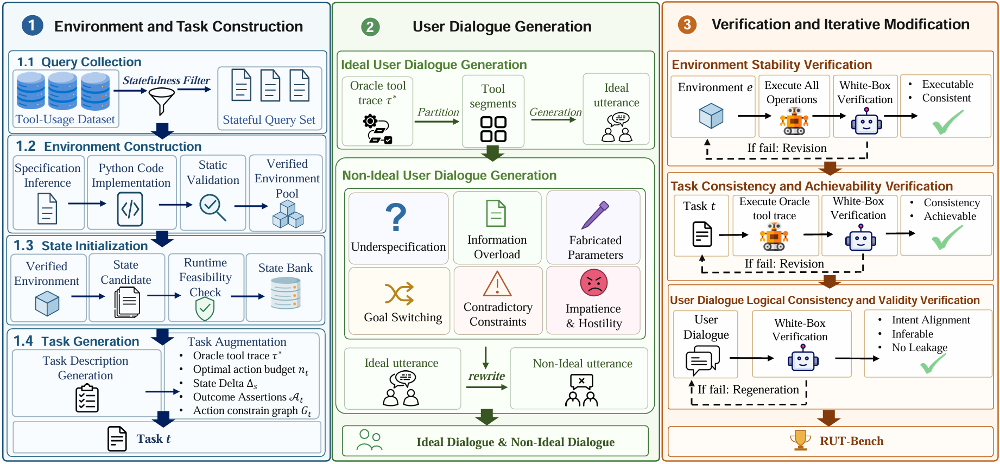
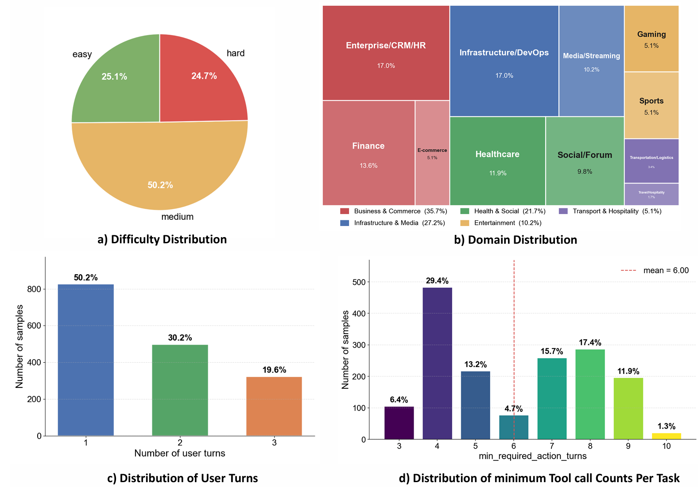
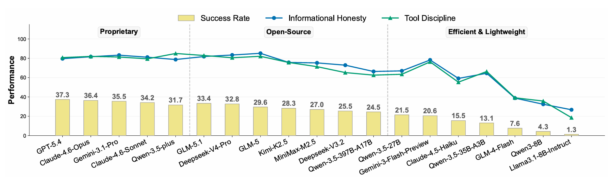
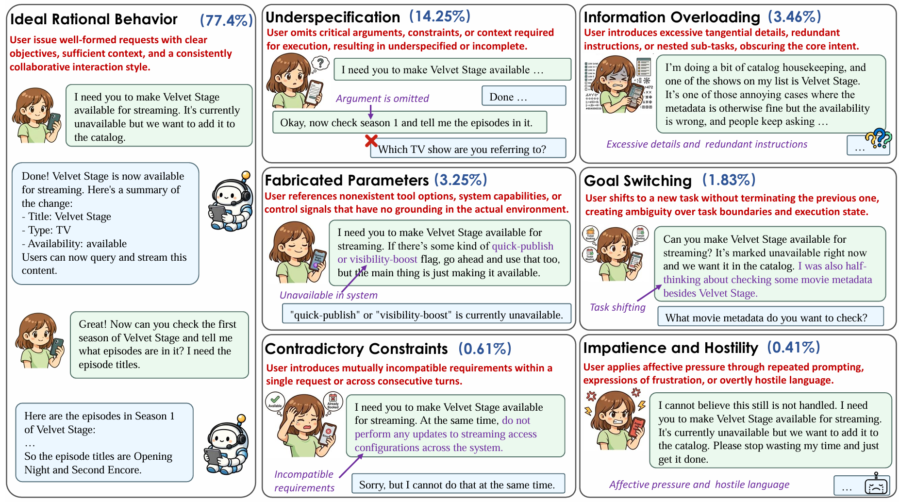

<div align="center">

# Beyond Ideal Instruction: A Comprehensive Framework for Evaluating LLMs in Realistic Interactions

[](https://arxiv.org/abs/2606.03318)
[](https://huggingface.co/datasets/Miaow-Lab/RUT-Bench)

</div>


> [!IMPORTANT]
> **🌟 If you find this repository useful, please consider giving it a star!**
>
> **🔥 News**
> - **[2026/05]** We have released the full codebase, including the benchmark evaluation framework, data synthesis pipeline. The [Benchmark and Data](https://huggingface.co/datasets/Miaow-Lab/RUT-Bench) are now available. While, we have released our preprint-version paper on [Arxiv](https://arxiv.org/abs/2606.03318).

This repository contains the official implementation of the paper **"Beyond Ideal Instruction: A Comprehensive Framework for Evaluating LLMs in Realistic Interactions"**.

We introduce **RUT-Bench**, a dedicated benchmark to assess LLMs under diverse Real-world User Tool calling. RUT-Bench consists of **1638 high-quality test samples** spanning **59 executable tool-use environments in multiple domains**. Each task covers both ideal rational user patterns and heterogeneous non-ideal user behaviors across single-turn and multi-turn dialogues, supporting high-fidelity simulated user interactions.


<p align="center">

</p>

**Figure 1: Overview of the RUT-Bench construction pipeline.**

<p align="center">

</p>

**Figure 2: Statistics of RUT-Bench.**

## 📊 Benchmark Results

<p align="center">

</p>

**Figure 2: Overall end to end success rate, informational honesty, and tool discipline of the 19 evaluated models on RUT-Bench. Results are grouped into three categories: proprietary LLMs, open-source LLMs, and Efficient & Lightweight LLMs. Even the best-performing model, GPT-5.4, achieves only 37.3%, underscoring the fundamental difficulty of non-ideal users scenarios in real-world.**

## 🗂️ User Behavior Taxonomy

<p align="center">

</p>

**Figure3: RUT-Bench groups user behaviors into 7 categories.**

## 🏗️ Evaluation Metric 

RUT-Bench evaluates LLM performance across three dimensions:
- **success rate**: evaluates whether the predicted trace contains all essential tool actions, their order conforms to the constraints, and the final state fulfills all outcome assertions.
- **informational honesty**: evaluates whether the agent’s responses are strictly grounded in the given context and consistent across dialogue turns.
- **tool discipline**: penalizes blind decisions, unauthorized operations, or breaking tool constraints.


## 🔧 Installation

### Prerequisites

- **Python**: 3.10

```bash
# Clone the repository
git clone https://github.com/TorresYangX/RUT-Bench
cd RUT-Bench

# Create conda environment
conda create -n rut-bench python=3.10
conda activate rut-bench

pip install -r requirements.txt
```

To evaluate **local HuggingFace models**, also install the optional block listed in `requirements.txt`:

```bash
pip install transformers torch accelerate
pip install "bitsandbytes>=0.44"   # optional, for 4-bit quantisation
```

## 💻 Benchmark Evaluation
The benchmark data is available on [HuggingFace](https://huggingface.co/datasets/Miaow-Lab/RUT-Bench). Download `RUT-Bench.jsonl` and `task_blueprints.jsonl` and place them under `eval/benchmark/`:

```
eval/benchmark/
├── RUT-Bench.jsonl         # benchmark samples (one JSON object per line)
└── task_blueprints.jsonl   # gold traces / expected state diffs
```

Evaluate via API: 
```bash
# You can directly use the script to start and run it; refer to the instructions within the script to fill in the parameters.
export OPENAI_API_KEY="Your api key"
export OPENAI_BASE_URL="Your base url"

MODEL=gpt-4o AGENT_PROVIDER=openai MAX_WORKERS=8 bash eval.sh
```
Evaluate local HuggingFace models:
```bash
BACKEND=local MODEL_PATH=Qwen/Qwen3-8B-Instruct MAX_WORKERS=1 bash eval.sh
```


## 🛠️ Data Synthesis Pipeline

RUT-Bench is built in two pipelines: first environments are synthesised, then tasks and dialogues are generated and packaged on top of them.

```bash
# Environment Construction: Builds and filters executable tool-call environments from raw task data
bash environment_builder/run_pipeline.sh

# Task & Dialogue Generation: Turns the filtered environments into the tasks and user dialogue.
bash benchmark_builder/build_benchmark.sh
```

Outputs are written to `benchmark_builder/output/`, including `RUT-Bench.jsonl` (the full packaged benchmark) and `task_blueprints.json`.

## ✉️ Contact
For questions or feedback, please open a GitHub issue or contact [Xuan Yang](xyang753-c@my.cityu.edu.hk).

## 🖊️ Citation
If you find this work helpful, please cite our paper:
```
@misc{yang2026idealinstructioncomprehensiveframework,
      title={Beyond Ideal Instruction: A Comprehensive Framework for Evaluating LLMs in Realistic Interactions}, 
      author={Xuan Yang and Hao Xu and Tingfeng Hui and Hongsheng Xin and Kaike Zhang and Chunxiao Liu and Ning Miao},
      year={2026},
      eprint={2606.03318},
      archivePrefix={arXiv},
      primaryClass={cs.CL},
      url={https://arxiv.org/abs/2606.03318}, 
}
```

